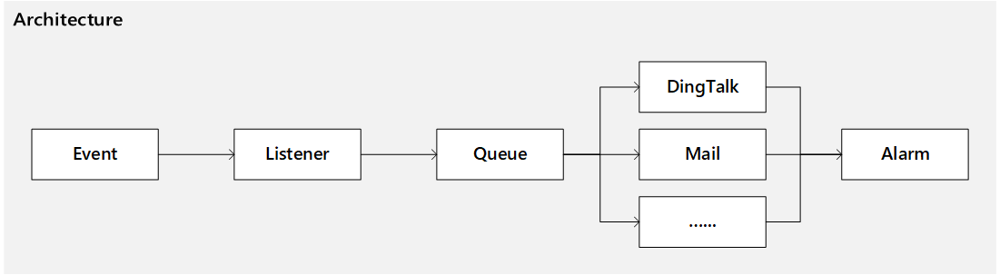
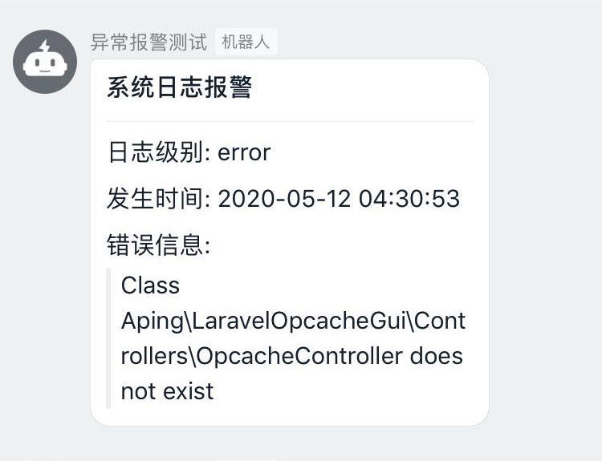

## Laravel Alarm



laravel alarm for exception or anything（异常报警或自定义报警通知）

## Todo

- [x] ~~DingTalk Robot（钉钉机器人通知）~~
- [ ] Mail（邮件通知）
- [ ] Rate Limit（限频）
- [x] ~~Locale（多语言）~~
- [ ] Tests

## Install

composer
```php
php composer.phar require aping/laravel-alarm
```
或
```php
"require": {
    "aping/laravel-alarm": "dev-master"
}
```

## Config

Laravel 5.5+:

Add Service Provider to config/app.php in providers section
```php
Aping\LaravelAlarm\AlarmServiceProvider::class,
```

Publish config

```php
php artisan vendor:publish --provider="Aping\LaravelAlarm\AlarmServiceProvider"
```

Start the queue:
```php
php artisan queue:work --queue=laravel-alarm
```

Finished

## Custom Event Alarm

In config/alarm.php 

```php
'events' => [
    //system log（日志事件）
    Illuminate\Log\Events\MessageLogged::class => [
        Aping\LaravelAlarm\Alarms\Handlers\DingTalk\MessageLoggedAlarm::class,
    ],
    //custom event（自定义事件）
    event::class => [
        //alarm,must be implemented "Aping\LaravelAlarm\Alarms\Alarm"
        //报警器，必须实现接口Aping\LaravelAlarm\Alarms\Alarm
        Alarms::class,
    ],
],
```
The implemented（已实现的报警接口）
+ `Aping\LaravelAlarm\Alarms\DingTalkAlarm`

## Tips

DingTalk security mode suggests using signatures.

钉钉机器人安全模式建议用签名（最好不要用关键字）

## Screenshot



## Last

alarm anything,implemented interface "Aping\LaravelAlarm\Alarms\Alarm"
